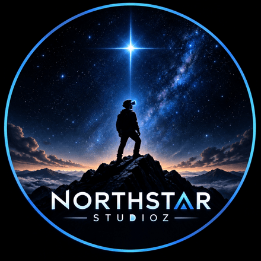

<p align="center">
  
</p>

<h1 align="center">NorthStar Studioz</h1>

<p align="center">
  An independent studio making hand-tracked mixed reality games for Meta Quest.
</p>

<p align="center">
  <a href="https://vikas9793.github.io/NorthStarStudioz/">Website</a> ·
  <a href="https://vikas9793.github.io/NorthStarStudioz/privacy.html">Privacy Policy</a> ·
  <a href="https://vikas9793.github.io/NorthStarStudioz/terms.html">Terms of Service</a>
</p>

---

## About

NorthStar Studioz is an independent game studio based in India, founded by Vikas Sahani ([@VIKAS9793](https://github.com/VIKAS9793)). The studio is currently prototyping its first title.

This repository contains the studio website and its public policies. Game source code, design documents and roadmaps are kept private.

## What we build

Our games are designed around four principles:

- **Hands first.** Players pinch, grab, turn and snap objects using hand tracking. Controllers are supported as a fallback.
- **The room is the level.** Passthrough and scene understanding turn real tables, floors and walls into play surfaces.
- **Physical sound.** Audio is sampled from real materials and rendered spatially.
- **Comfortable by default.** Play is stationary, with no artificial locomotion.

**Target platform:** Meta Horizon OS (Meta Quest 3 and Quest 3S), built with Unity URP, OpenXR and the Meta XR SDK.

## Website

The website in [`website/`](website/) is plain HTML and CSS. It uses no framework and makes no third-party requests. Every push to `main` deploys it to GitHub Pages through [`.github/workflows/deploy.yml`](.github/workflows/deploy.yml).

| Path | Purpose |
| --- | --- |
| `website/index.html` | Home page, including the intro screen |
| `website/styles.css` | All styles: self-hosted fonts, design tokens and animations |
| `website/assets/js/site.js` | Header, menu, scroll reveals and intro controller |
| `website/assets/js/gate-3d.js` | Generated 3D headset bundle. Do not edit by hand. |
| `src/gate/headset.js` | Source for the 3D headset (three.js) |
| `scripts/verify.mjs` | Security checks that run in CI |

### Local development

```bash
npm ci                  # install build tooling (esbuild, three)
npm run build           # rebuild website/assets/js/gate-3d.js from src/
npm run verify          # check CSP hashes, third-party loads and unsafe DOM sinks
npx serve website       # serve locally, then open http://localhost:3000
```

After editing an inline `<script>` in any page, run `npm run verify -- --fix-hashes` to update that page's Content Security Policy. CI fails if the committed bundle differs from a fresh build or if any security check fails.

## Contact

Email [studioznorthstar@gmail.com](mailto:studioznorthstar@gmail.com) for questions, partnerships or press. See [SUPPORT.md](SUPPORT.md) for other ways to reach us.

## Policies

- [LICENSE.md](LICENSE.md): proprietary license
- [SECURITY.md](SECURITY.md): vulnerability disclosure and the website security model
- [CONTRIBUTING.md](CONTRIBUTING.md): how to report issues and suggest changes
- [CODEOWNERS](.github/CODEOWNERS)

<sub>Meta, Meta Quest and Meta Horizon OS are trademarks of Meta Platforms, Inc. NorthStar Studioz is an independent developer and is not affiliated with or endorsed by Meta.</sub>
